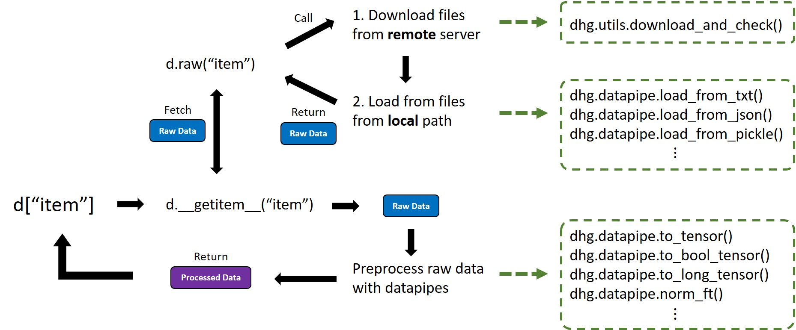

Building Dataset
==================

.. hint:: 

    - Author: `Yifan Feng (丰一帆) <https://fengyifan.site/>`_
    - Proof: Xinwei Zhang

DHG includes a number of datasets that can be used to train and test your models.
In this section, we will introduce how to use DHG's :doc:`data </api/data>` module,
the architecture of creating a data object, and how to build your own dataset and specified pre-processing steps.
We welcome to contribute to the dataset by submitting a pull request on `GitHub <https://github.com/iMoonLab/DeepHypergraph>`_,
please following the :doc:`instruction </start/contribution>` guide.

Basic Usages
-----------------------

You can directly use any of the datasets in :doc:`/api/data` as follows after your network is ready:

.. code-block:: python

    >>> import dhg
    >>> d = dhg.data.Cora()
    >>> d
    cora dataset:
    ->  num_classes
    ->  num_vertices
    ->  num_edges
    ->  dim_features
    ->  features
    ->  edge_list
    ->  labels
    ->  train_mask
    ->  val_mask
    ->  test_mask
    >>> d = dhg.data.Cooking200()
    >>> d
    cooking_200 dataset:
    ->  num_classes
    ->  num_vertices
    ->  num_edges
    ->  edge_list
    ->  labels
    ->  train_mask
    ->  val_mask
    ->  test_mask
    >>> d = dhg.data.MovieLens1M()
    >>> d
    movielens_1m dataset:
    ->  num_users
    ->  num_items
    ->  num_interactions
    ->  train_adj_list
    ->  test_adj_list

Or you can manually download the dataset from `DHG's data repository <https://data.deephypergraph.com/>`_.
Then, you can put the dataset in the ``dhg.CAHE_ROOT`` directory or any other directory you want.
You can fetch your ``CACHE_ROOT`` by:

.. code-block:: python

    >>> dhg.CACHE_ROOT
    PosixPath('/home/fengyifan/.dhg')

If you put the dataset into the your specified directory ``<your-directory>``, you can use the following code to load the dataset:

.. note:: You should pass the parent directory of your downloaded dataset to the ``data_root`` parameter.

.. code-block:: python

    >>> dhg.data.Cora(data_root=<your-directory>)

As soon as you load the dataset and fetch the data object ``d``, you can use the following code to get **preprocessed** items from the dataset:

.. code-block:: python

    >>> d = dhg.data.Cora()
    >>> # print all available items in the dataset
    >>> d
    cora dataset:
    ->  num_classes
    ->  num_vertices
    ->  num_edges
    ->  dim_features
    ->  features
    ->  edge_list
    ->  labels
    ->  train_mask
    ->  val_mask
    ->  test_mask
    >>> d['num_classes']
    7
    >>> d["edge_list"]
    [(0, 633), (0, 1862), (0, 2582), (1, 2), ..., (2707, 165), (2707, 1473), (2707, 2706)]
    >>> d['features']
    tensor([[0., 0., 0.,  ..., 0., 0., 0.],
            [0., 0., 0.,  ..., 0., 0., 0.],
            [0., 0., 0.,  ..., 0., 0., 0.],
            ...,
            [0., 0., 0.,  ..., 0., 0., 0.],
            [0., 0., 0.,  ..., 0., 0., 0.],
            [0., 0., 0.,  ..., 0., 0., 0.]])
    >>> d['labels']
    >>> d['labels']
    tensor([3, 4, 4,  ..., 3, 3, 3])
    >>> d['train_mask']
    tensor([ True,  True,  True,  ..., False, False, False])

.. code-block:: python

    >>> d = dhg.data.MovieLens1M()
    >>> # print all available items in the dataset
    >>> d
    movielens_1m dataset:
    ->  num_users
    ->  num_items
    ->  num_interactions
    ->  train_adj_list
    ->  test_adj_list
    >>> d['num_users']
    6022
    >>> d['test_adj_list']
    [[0, 2968, 228, 38, 422, 2769], [1, 621, 900, ...], ..., [..., 1579, 3039, 1699, 1195]]

Call the :py:meth:`raw() <dhg.data.BaseData.raw>` method if you want to get the **un-preprocessed** items:

.. code-block:: python

    >>> d = dhg.data.Cora()
    >>> ft = d['features']
    >>> ft.sum(1)
    tensor([1.0000, 1.0000, 1.0000,  ..., 1.0000, 1.0000, 1.0000])
    >>> raw_ft = d.raw('features')
    >>> raw_ft.sum(1)
    matrix([[ 9.],
            [23.],
            [19.],
            ...,
            [18.],
            [14.],
            [13.]], dtype=float32)

The vertex featue is pre-processed with L1 normalization in Cora dataset in default.
To build a graph structucture for training in Cora dataset, you can refer to the :ref:`construct a graph from edge list <build_graph>` tutorial.

Architechture
-----------------------
The architecture of constructing DHG's dataset object is shown in the following figure.

Building Your Own Dataset
---------------------------

At first you should inherit your data class from the :py:class:`BaseData <dhg.data.BaseData>` class.

.. code-block:: python

    >>> from dhg.data import BaseData

All the items in the dataset are configured in the ``_content`` dictionary. Currently, the following items are supported:

- download from remote server -> load from local file -> preprocess and return
- load from local file -> preprocess and return
- directly return

The supported loader functions can be found in :ref:`here <api_datapipe_loader>`.

The supported preprocess functions can be found in :ref:`here <api_datapipe_preprocess>`.

If the ``item`` should be downloaded from a remote server, you should specify the ``upon``, ``loader``, and ``preprocess`` keys in the ``_content`` dictionary.
The ``upon`` key is a list of dictionaries, each dictionary at lease contains the ``filename`` and ``md5`` keys.
The ``filename`` is the name of the file to be downloaded, and the ``md5`` is the md5 checksum of the file.
Defaultly, remote file is stored in the ``REMOTE_DATASETS_ROOT / data_root / name / filename`` directory.

.. code-block:: python

    self._content = {
        'item': {
            'upon': [
                {'filename': 'part1.pkl', 'md5': '', bk_url: None},
                {'filename': 'part2.pkl', 'md5': '', bk_url: None},
            ],
            'loader': loader_function,
            'preprocess': [datapipe1, datapipe2],
        },
        ...
    }

If the ``item`` relay on a local file, you should also specify the ``upon``, ``loader``, and ``preprocess`` keys in the ``_content`` dictionary.
But the file should be put into the ``data_root / name / filename`` directory.
Then, the :py:class:`BaseData <dhg.data.BaseData>` class will automatically check the file's md5 checksum.

.. code-block:: python

    self._content = {
        'item': {
            'upon': [
                {'filename': 'part1.pkl', 'md5': '', bk_url: None},
                {'filename': 'part2.pkl', 'md5': '', bk_url: None},
            ],
            'loader': loader_function,
            'preprocess': [datapipe1, datapipe2],
        },
        ...
    }

If the ``item`` is a fixed value, you can directly specify the ``value`` in the ``_content`` dictionary.

.. code-block:: python

    self._content = {
        'item': 666666,
        ...
    }

Example of Graph Dataset:
++++++++++++++++++++++++++++

.. code-block:: python

    class Cora(BaseData):
        def __init__(self, data_root: Optional[str] = None) -> None:
            super().__init__('cora', data_root)
            self._content = {
                "num_classes": 7,
                "num_vertices": 2708,
                "num_edges": 10858,
                "dim_features": 1433,
                'features': {
                    'upon': [{ 'filename': 'features.pkl', 'md5': '05b45e9c38cc95f4fc44b3668cc9ddc9' }],
                    'loader': load_from_pickle,
                    'preprocess': [to_tensor, partial(norm_ft, ord=1)],
                },
                'edge_list': {
                    'upon': [{ 'filename': 'edge_list.pkl', 'md5': 'f488389c1edd0d898ce273fbd27822b3' }],
                    'loader': load_from_pickle,
                },
                'labels': {
                    'upon': [{ 'filename': 'labels.pkl', 'md5': 'e506014762052c6a36cb583c28bdae1d' }],
                    'loader': load_from_pickle,
                    'preprocess': [to_long_tensor],
                },
                'train_mask': {
                    'upon': [{ 'filename': 'train_mask.pkl', 'md5': 'a11357a40e1f0b5cce728d1a961b8e13' }],
                    'loader': load_from_pickle,
                    'preprocess': [to_bool_tensor],
                },
                'val_mask': {
                    'upon': [{ 'filename': 'val_mask.pkl', 'md5': '355544da566452601bcfa74d30539a71' }],
                    'loader': load_from_pickle,
                    'preprocess': [to_bool_tensor],
                },
                'test_mask': {
                    'upon': [{ 'filename': 'test_mask.pkl', 'md5': 'bbfc87d661560f55f6946f8cb9d602b9' }],
                    'loader': load_from_pickle,
                    'preprocess': [to_bool_tensor],
                },
            }

Example of Hypergraph Dataset
++++++++++++++++++++++++++++++++

.. code-block:: python

    class Cooking200(BaseData):
        def __init__(self, data_root: Optional[str] = None) -> None:
            super().__init__("cooking_200", data_root)
            self._content = {
                "num_classes": 20,
                "num_vertices": 7403,
                "num_edges": 2755,
                "edge_list": {
                    "upon": [
                        {
                            "filename": "edge_list.pkl",
                            "md5": "2cd32e13dd4e33576c43936542975220",
                        }
                    ],
                    "loader": load_from_pickle,
                },
                "labels": {
                    "upon": [
                        {
                            "filename": "labels.pkl",
                            "md5": "f1f3c0399c9c28547088f44e0bfd5c81",
                        }
                    ],
                    "loader": load_from_pickle,
                    "preprocess": [to_long_tensor],
                },
                "train_mask": {
                    "upon": [
                        {
                            "filename": "train_mask.pkl",
                            "md5": "66ea36bae024aaaed289e1998fe894bd",
                        }
                    ],
                    "loader": load_from_pickle,
                    "preprocess": [to_bool_tensor],
                },
                "val_mask": {
                    "upon": [
                        {
                            "filename": "val_mask.pkl",
                            "md5": "6c0d3d8b752e3955c64788cc65dcd018",
                        }
                    ],
                    "loader": load_from_pickle,
                    "preprocess": [to_bool_tensor],
                },
                "test_mask": {
                    "upon": [
                        {
                            "filename": "test_mask.pkl",
                            "md5": "0e1564904551ba493e1f8a09d103461e",
                        }
                    ],
                    "loader": load_from_pickle,
                    "preprocess": [to_bool_tensor],
                },
            }

Example of User-Item Bipartite Dataset
++++++++++++++++++++++++++++++++++++++++++++

.. code-block:: python

    class MovieLens1M(BaseData):
        def __init__(self, data_root: Optional[str] = None) -> None:
            super().__init__("movielens_1m", data_root)
            self._content = {
                "num_users": 6022,
                "num_items": 3043,
                "num_interactions": 995154,
                "train_adj_list": {
                    "upon": [
                        {
                            "filename": "train.txt",
                            "md5": "db93f671bc5d1b1544ce4c29664f6778",
                        }
                    ],
                    "loader": partial(load_from_txt, dtype="int", sep=" "),
                },
                "test_adj_list": {
                    "upon": [
                        {
                            "filename": "test.txt",
                            "md5": "5e55bcbb6372ad4c6fafe79989e2f956",
                        }
                    ],
                    "loader": partial(load_from_txt, dtype="int", sep=" "),
                },
            }
