Building Structure
===================================

.. hint::

    - Author: `Yifan Feng (丰一帆) <https://fengyifan.site/>`_
    - Proof: Xinwei Zhang

Correlation structures are the core of **DHG**. In this section, we introduce the basic construction methods of different structures
and some structure transformation functions of them, including:

- Reducing the high-order structrue to the low-order structure
- Promoting the low-order structure to the high-order structure

Low-Order Structures
-----------------------

Currently, DHG's low-order structures include graph, directed graph, and bipartite graph.
In the future, we will add more low-order structures.

.. _build_graph:

Building Graph
+++++++++++++++++++++++

A `graph <https://en.wikipedia.org/wiki/Graph_(discrete_mathematics)>`_ is a graph with no loops and no multiple edges, where the edges ``(x, y)`` and ``(y, x)`` are the same edge.
It can be constructed by the following methods:

- Edge list (**default**) :py:class:`dhg.Graph`
- Adjacency list :py:meth:`dhg.Graph.from_adj_list`
- Reduced from the hypergraph structure

  - Star expansion :py:meth:`dhg.Graph.from_hypergraph_star`
  - Clique expansion :py:meth:`dhg.Graph.from_hypergraph_clique`
  - `HyperGCN <https://arxiv.org/pdf/1809.02589.pdf>`_-based expansion :py:meth:`dhg.Graph.from_hypergraph_hypergcn`

Common Methods
^^^^^^^^^^^^^^^^^^^

**Construct a graph from edge list with** :py:class:`dhg.Graph`

.. code-block:: python

    >>> import dhg
    >>> g = dhg.Graph(5, [(0, 1), (0, 2), (1, 2), (3, 4)])
    >>> g
    Graph(num_v=5, num_e=4)
    >>> g.v
    [0, 1, 2, 3, 4]
    >>> g.e
    ([(0, 1), (0, 2), (1, 2), (3, 4)], [1.0, 1.0, 1.0, 1.0])
    >>> e_list, e_weight = g.e
    >>> e_list
    [(0, 1), (0, 2), (1, 2), (3, 4)]
    >>> e_weight
    [1.0, 1.0, 1.0, 1.0]
    >>> g.e_both_side
    ([(0, 1), (0, 2), (1, 2), (3, 4), (1, 0), (2, 0), (2, 1), (4, 3)], [1.0, 1.0, 1.0, 1.0, 1.0, 1.0, 1.0, 1.0])
    >>> # print the adjacency matrix
    >>> g.A.to_dense()
    tensor([[0., 1., 1., 0., 0.],
            [1., 0., 1., 0., 0.],
            [1., 1., 0., 0., 0.],
            [0., 0., 0., 0., 1.],
            [0., 0., 0., 1., 0.]])

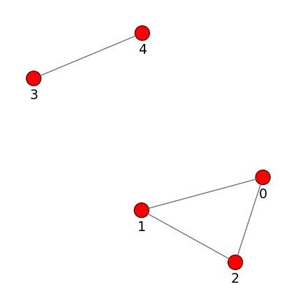

You can find that the adjacency matrix of the graph is a symmetric matrix.
The :py:attr:`g.e <dhg.Graph.e>` attribute will return a tuple of two lists, the first list is the edge list and the second list is a list of weight for each edge.
The :py:attr:`g.e_both_side <dhg.Graph.e_both_side>` attribute will return the both side of edges in the graph.

.. important::

    In graph the edge is unordered pair, which means ``(0, 1)`` and ``(1, 0)`` are the same edge. Adding edges ``(0, 1)`` and ``(1, 0)`` is equivalent to adding edge ``(0, 1)`` twice.

.. code-block:: python

    >>> g = dhg.Graph(5, [(0, 1), (0, 2), (2, 0), (3, 4)])
    >>> g.e
    ([(0, 1), (0, 2), (3, 4)], [1.0, 1.0, 1.0])
    >>> g.add_edges([(0, 1), (4, 3)])
    >>> g.e
    ([(0, 1), (0, 2), (3, 4)], [1.0, 1.0, 1.0])

.. note::

    If the added edges have duplicate edges, those duplicate edges will be automatically merged with specified ``merge_op``.

.. code-block:: python

    >>> g = dhg.Graph(5, [(0, 1), (0, 2), (0, 2), (3, 4)], merge_op="mean")
    >>> g.e
    ([(0, 1), (0, 2), (3, 4)], [1.0, 1.0, 1.0])
    >>> g = dhg.Graph(5, [(0, 1), (0, 2), (0, 2), (3, 4)], merge_op="sum")
    >>> g.e
    ([(0, 1), (0, 2), (3, 4)], [1.0, 2.0, 1.0])
    >>> g.add_edges([(1, 0), (3, 2)], merge_op="mean")
    >>> g.e
    ([(0, 1), (0, 2), (3, 4), (2, 3)], [1.0, 2.0, 1.0, 1.0])
    >>> g.add_edges([(1, 0), (2, 3)], merge_op="sum")
    >>> g.e
    ([(0, 1), (0, 2), (3, 4), (2, 3)], [2.0, 2.0, 1.0, 2.0])

You can find the weight of the last edge is ``1.0`` and ``2.0``, if you set the ``merge_op`` to ``mean`` and ``sum``, respectively.

**Construct a graph from adjacency list with** :py:meth:`dhg.Graph.from_adj_list`

The adjacency list is a list of lists, each list contains two parts. The first part is the **first element** of the list, which is the vertex index of the source vertex.
The second part is the **remaining elements** of the list, which are the vertex indices of the destination vertices.
For example, assuming we have a graph with 5 vertices and a adjacency list as:

.. code-block::

    [[0, 1, 2], [0, 3], [1, 2], [3, 4]]

Then, the transformed edge list is:

.. code-block::

    [(0, 1), (0, 2), (0, 3), (1, 2), (3, 4)]

We can construct a graph from the adjacency list as:

.. code-block:: python

    >>> g = dhg.Graph.from_adj_list(5, [[0, 1, 2], [1, 3], [4, 3, 0, 2, 1]])
    >>> g.e
    ([(0, 1), (0, 2), (1, 3), (3, 4), (0, 4), (2, 4), (1, 4)], [1.0, 1.0, 1.0, 1.0, 1.0, 1.0, 1.0])
    >>> g.A.to_dense()
    tensor([[0., 1., 1., 0., 1.],
            [1., 0., 0., 1., 1.],
            [1., 0., 0., 0., 1.],
            [0., 1., 0., 0., 1.],
            [1., 1., 1., 1., 0.]])

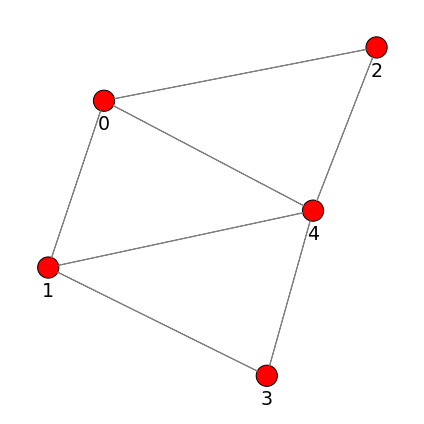

Reduced from High-Order Structures
^^^^^^^^^^^^^^^^^^^^^^^^^^^^^^^^^^^^

We first define a hypergraph as:

.. code-block:: python

    >>> hg = dhg.Hypergraph(5, [(0, 1, 2), (1, 3, 2), (1, 2), (0, 3, 4)])
    >>> hg.e
    ([(0, 1, 2), (1, 2, 3), (1, 2), (0, 3, 4)], [1.0, 1.0, 1.0, 1.0])
    >>> # print hypergraph incidence matrix
    >>> hg.H.to_dense()
    tensor([[1., 0., 0., 1.],
            [1., 1., 1., 0.],
            [1., 1., 1., 0.],
            [0., 1., 0., 1.],
            [0., 0., 0., 1.]])

**Star Expansion** :py:meth:`dhg.Graph.from_hypergraph_star`

The star expansion will treat the hyperedges in the hypergraph as virtual vertices in the graph.
Each virtual vertex will connect to all the vertices in the hyperedge.
The :py:meth:`dhg.Graph.from_hypergraph_star` function will return two values.
The first value is the reduced graph and the second value is a ``vertex mask`` that indicates whether the vertex is a actual vertex.
The ``True`` in the ``vertex mask`` indicates the vertex is a actual vertex and the ``False`` indicates the vertex is a virtual vertex that is transformed from a hyperedge.

.. code-block:: python

    >>> g, v_mask = dhg.Graph.from_hypergraph_star(hg)
    >>> g
    Graph(num_v=9, num_e=11)
    >>> g.e[0]
    [(0, 5), (0, 8), (1, 5), (1, 6), (1, 7), (2, 5), (2, 6), (2, 7), (3, 6), (3, 8), (4, 8)]
    >>> v_mask
    tensor([ True,  True,  True,  True,  True, False, False, False, False])
    >>> g.A.to_dense()
    tensor([[0., 0., 0., 0., 0., 1., 0., 0., 1.],
            [0., 0., 0., 0., 0., 1., 1., 1., 0.],
            [0., 0., 0., 0., 0., 1., 1., 1., 0.],
            [0., 0., 0., 0., 0., 0., 1., 0., 1.],
            [0., 0., 0., 0., 0., 0., 0., 0., 1.],
            [1., 1., 1., 0., 0., 0., 0., 0., 0.],
            [0., 1., 1., 1., 0., 0., 0., 0., 0.],
            [0., 1., 1., 0., 0., 0., 0., 0., 0.],
            [1., 0., 0., 1., 1., 0., 0., 0., 0.]])

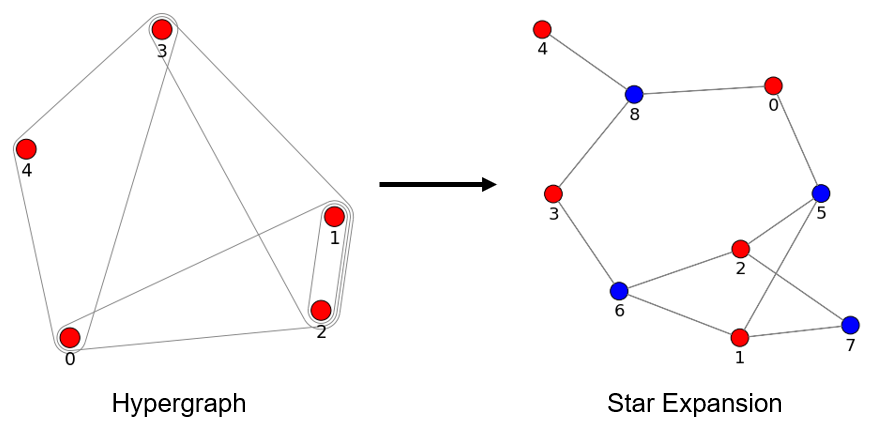

**Clique Expansion** :py:meth:`dhg.Graph.from_hypergraph_clique`

Unlike the star expansion, the clique expansion will not add any virtual vertex to the graph.
It is designed to reduce the hyperedges in the hypergraph to the edges in the graph.
For each hyperedge, the clique expansion will add edges to any two vertices in the hyperedge.

.. code-block:: python

    >>> g = dhg.Graph.from_hypergraph_clique(hg)
    >>> g
    Graph(num_v=5, num_e=8)
    >>> g.e
    ([(0, 1), (0, 2), (0, 3), (0, 4), (1, 2), (1, 3), (2, 3), (3, 4)], [1.0, 1.0, 1.0, 1.0, 1.0, 1.0, 1.0, 1.0])
    >>> g.A.to_dense()
    tensor([[0., 1., 1., 1., 1.],
            [1., 0., 1., 1., 0.],
            [1., 1., 0., 1., 0.],
            [1., 1., 1., 0., 1.],
            [1., 0., 0., 1., 0.]])

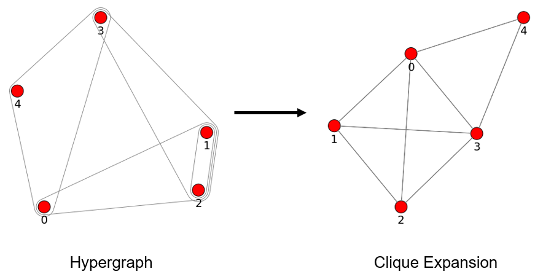

**HyperGCN-based Expansion** :py:meth:`dhg.Graph.from_hypergraph_hypergcn`

In the `HyperGCN <https://arxiv.org/pdf/1809.02589.pdf>`_ paper, the authors also describe
a method to reduce the hyperedges in the hypergraph to the edges in the graph as the following figure.

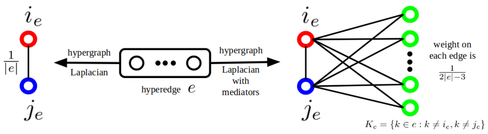

.. code-block:: python

    >>> X = torch.tensor(([[0.6460, 0.0247],
                           [0.9853, 0.2172],
                           [0.7791, 0.4780],
                           [0.0092, 0.4685],
                           [0.9049, 0.6371]]))
    >>> g = dhg.Graph.from_hypergraph_hypergcn(hg, X)
    >>> g
    Graph(num_v=5, num_e=4)
    >>> g.e
    ([(0, 2), (2, 3), (1, 2), (3, 4)], [0.3333333432674408, 0.3333333432674408, 0.5, 0.3333333432674408])
    >>> g.A.to_dense()
    tensor([[0.0000, 0.0000, 0.3333, 0.0000, 0.0000],
            [0.0000, 0.0000, 0.5000, 0.0000, 0.0000],
            [0.3333, 0.5000, 0.0000, 0.3333, 0.0000],
            [0.0000, 0.0000, 0.3333, 0.0000, 0.3333],
            [0.0000, 0.0000, 0.0000, 0.3333, 0.0000]])
    >>> g = dhg.Graph.from_hypergraph_hypergcn(hg, X, with_mediator=True)
    >>> g
    Graph(num_v=5, num_e=6)
    >>> g.e
    ([(1, 2), (0, 1), (2, 3), (1, 3), (3, 4), (0, 3)], [0.3333333432674408, 0.3333333432674408, 0.3333333432674408, 0.3333333432674408, 0.3333333432674408, 0.3333333432674408])
    >>> g.A.to_dense()
    tensor([[0.0000, 0.3333, 0.0000, 0.3333, 0.0000],
            [0.3333, 0.0000, 0.3333, 0.3333, 0.0000],
            [0.0000, 0.3333, 0.0000, 0.3333, 0.0000],
            [0.3333, 0.3333, 0.3333, 0.0000, 0.3333],
            [0.0000, 0.0000, 0.0000, 0.3333, 0.0000]])

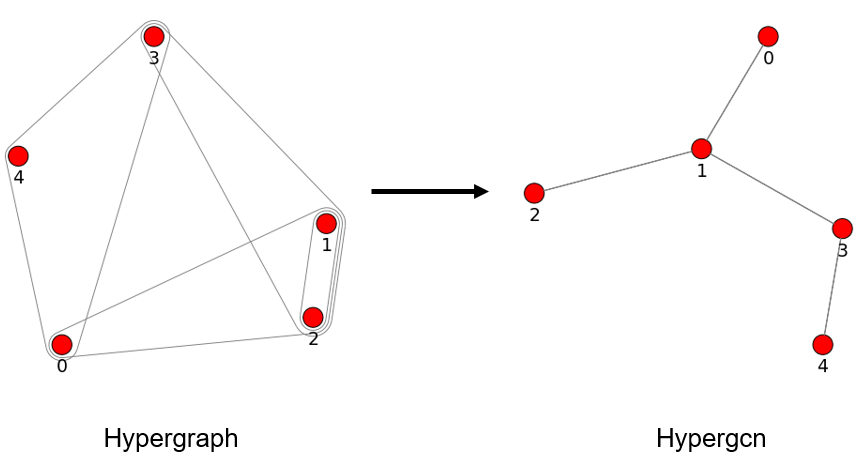

.. _build_directed_graph:

Building Directed Graph
+++++++++++++++++++++++

A `directed graph <https://en.wikipedia.org/wiki/Directed_graph>`_ is a graph with directed edges, where the edge ``(x, y)`` and edge ``(y, x)`` can exist simultaneously in the structure.
It can be constructed by the following methods:

- Edge list (**default**) :py:class:`dhg.DiGraph`
- Adjacency list :py:meth:`dhg.DiGraph.from_adj_list`
- Features with k-Nearest Neighbors :py:meth:`dhg.DiGraph.from_feature_kNN`

Common Methods
^^^^^^^^^^^^^^^^^^^
.. note::

    The directed graph also support merging duplicated edges with ``merge_op`` parameter in construction or adding edges.

**Construct a directed graph from edge list with** :py:class:`dhg.DiGraph`

.. code-block:: python

    >>> import dhg
    >>> g = dhg.DiGraph(5, [(0, 3), (2, 4), (4, 2), (3, 1)])
    >>> g
    Directed Graph(num_v=5, num_e=4)
    >>> g.e
    ([(0, 3), (2, 4), (4, 2), (3, 1)], [1.0, 1.0, 1.0, 1.0])
    >>> # print the adjacency matrix
    >>> g.A.to_dense()
    tensor([[0., 0., 0., 1., 0.],
            [0., 0., 0., 0., 0.],
            [0., 0., 0., 0., 1.],
            [0., 1., 0., 0., 0.],
            [0., 0., 1., 0., 0.]])

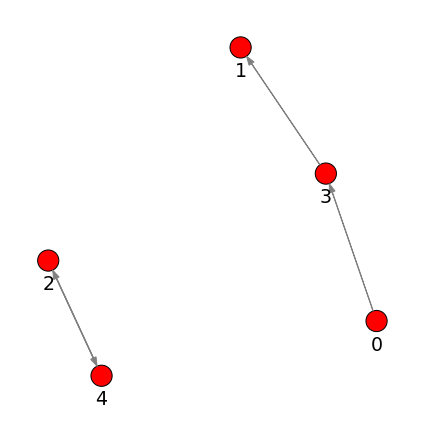

You can find that the adjacency matrix of the directed graph is not symmetric.

**Construct a directed graph from adjacency list with** :py:meth:`dhg.DiGraph.from_adj_list`

.. code-block:: python

    >>> g = dhg.DiGraph.from_adj_list(5, [(0, 3, 4), (2, 1, 3), (3, 0)])
    >>> g
    Directed Graph(num_v=5, num_e=5)
    >>> g.e
    ([(0, 3), (0, 4), (2, 1), (2, 3), (3, 0)], [1.0, 1.0, 1.0, 1.0, 1.0])
    >>> # print the adjacency matrix
    >>> g.A.to_dense()
    tensor([[0., 0., 0., 1., 1.],
            [0., 0., 0., 0., 0.],
            [0., 1., 0., 1., 0.],
            [1., 0., 0., 0., 0.],
            [0., 0., 0., 0., 0.]])

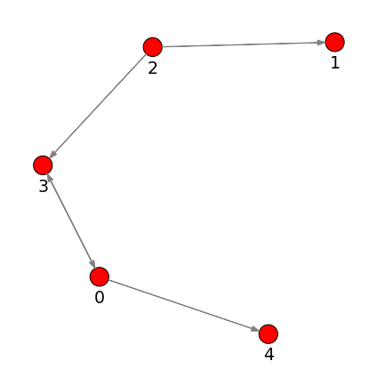

**Construct a directed graph from feature k-Nearest Neighbors with** :py:meth:`dhg.DiGraph.from_feature_kNN`

.. code-block:: python

    >>> X = torch.tensor(([[0.6460, 0.0247],
                           [0.9853, 0.2172],
                           [0.7791, 0.4780],
                           [0.0092, 0.4685],
                           [0.9049, 0.6371]]))
    >>> g = dhg.DiGraph.from_feature_kNN(X, k=2)
    >>> g
    Directed Graph(num_v=5, num_e=10)
    >>> g.e
    ([(0, 1), (0, 2), (1, 2), (1, 0), (2, 4), (2, 1), (3, 2), (3, 0), (4, 2), (4, 1)], [1.0, 1.0, 1.0, 1.0, 1.0, 1.0, 1.0, 1.0, 1.0, 1.0])
    >>> g.A.to_dense()
    tensor([[0., 1., 1., 0., 0.],
            [1., 0., 1., 0., 0.],
            [0., 1., 0., 0., 1.],
            [1., 0., 1., 0., 0.],
            [0., 1., 1., 0., 0.]], dtype=torch.float64)

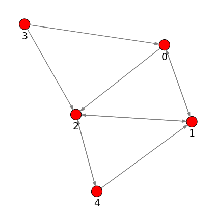

Reduced from High-Order Structures
^^^^^^^^^^^^^^^^^^^^^^^^^^^^^^^^^^^^

Welcome to contribute!

.. _build_bipartite_graph:

Building Bipartite Graph
+++++++++++++++++++++++++++

A `bipartite graph <https://en.wikipedia.org/wiki/Bipartite_graph>`_ is a graph that contains two types of vertices and edges between them,
whose partition has the parts vertex set :math:`\mathcal{U}` and vertex set :math:`\mathcal{V}`.
It can be constructed by the following methods:

- Edge list (**default**) :py:class:`dhg.BiGraph`
- Adjacency list :py:meth:`dhg.BiGraph.from_adj_list`
- Hypergraph :py:meth:`dhg.BiGraph.from_hypergraph`

Common Methods
^^^^^^^^^^^^^^^^^^^
.. note::

    The bipartite graph also support merging duplicated edges with ``merge_op`` parameter in construction or adding edges.

**Construct a bipartite graph from edge list with** :py:class:`dhg.BiGraph`

.. code-block:: python

    >>> import dhg
    >>> g = dhg.BiGraph(5, 4, [(0, 3), (4, 2), (1, 1), (2, 0)])
    >>> g
    Bipartite Graph(num_u=5, num_v=4, num_e=4)
    >>> g.e
    ([(0, 3), (4, 2), (1, 1), (2, 0)], [1.0, 1.0, 1.0, 1.0])
    >>> # print the bipartite adjacency matrix
    >>> g.B.to_dense()
    tensor([[0., 0., 0., 1.],
            [0., 1., 0., 0.],
            [1., 0., 0., 0.],
            [0., 0., 0., 0.],
            [0., 0., 1., 0.]])
    >>> # print the adjacency matrix
    >>> g.A.to_dense()
    tensor([[0., 0., 0., 0., 0., 0., 0., 0., 1.],
            [0., 0., 0., 0., 0., 0., 1., 0., 0.],
            [0., 0., 0., 0., 0., 1., 0., 0., 0.],
            [0., 0., 0., 0., 0., 0., 0., 0., 0.],
            [0., 0., 0., 0., 0., 0., 0., 1., 0.],
            [0., 0., 1., 0., 0., 0., 0., 0., 0.],
            [0., 1., 0., 0., 0., 0., 0., 0., 0.],
            [0., 0., 0., 0., 1., 0., 0., 0., 0.],
            [1., 0., 0., 0., 0., 0., 0., 0., 0.]])

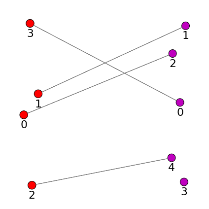

**Construct a bipartite graph from adjacency list with** :py:meth:`dhg.BiGraph.from_adj_list`

.. code-block:: python

    >>> g = dhg.BiGraph.from_adj_list(5, 4, [(0, 3, 2), (4, 2, 0), (1, 1, 2)])
    >>> g
    Bipartite Graph(num_u=5, num_v=4, num_e=6)
    >>> g.e
    ([(0, 3), (0, 2), (4, 2), (4, 0), (1, 1), (1, 2)], [1.0, 1.0, 1.0, 1.0, 1.0, 1.0])
    >>> g.B.to_dense()
    tensor([[0., 0., 1., 1.],
            [0., 1., 1., 0.],
            [0., 0., 0., 0.],
            [0., 0., 0., 0.],
            [1., 0., 1., 0.]])
    >>> g.A.to_dense()
    tensor([[0., 0., 0., 0., 0., 0., 0., 1., 1.],
            [0., 0., 0., 0., 0., 0., 1., 1., 0.],
            [0., 0., 0., 0., 0., 0., 0., 0., 0.],
            [0., 0., 0., 0., 0., 0., 0., 0., 0.],
            [0., 0., 0., 0., 0., 1., 0., 1., 0.],
            [0., 0., 0., 0., 1., 0., 0., 0., 0.],
            [0., 1., 0., 0., 0., 0., 0., 0., 0.],
            [1., 1., 0., 0., 1., 0., 0., 0., 0.],
            [1., 0., 0., 0., 0., 0., 0., 0., 0.]])

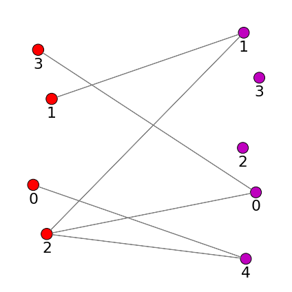

Reduced from High-Order Structures
^^^^^^^^^^^^^^^^^^^^^^^^^^^^^^^^^^^^

We first define a hypergraph as:

.. code-block:: python

    >>> hg = dhg.Hypergraph(5, [(0, 1, 2), (1, 3, 2), (1, 2), (0, 3, 4)])
    >>> hg.e
    ([(0, 1, 2), (1, 2, 3), (1, 2), (0, 3, 4)], [1.0, 1.0, 1.0, 1.0])
    >>> # print hypergraph incidence matrix
    >>> hg.H.to_dense()
    tensor([[1., 0., 0., 1.],
            [1., 1., 1., 0.],
            [1., 1., 1., 0.],
            [0., 1., 0., 1.],
            [0., 0., 0., 1.]])

**Construct a bipartite graph from hypergraph with** :py:meth:`dhg.BiGraph.from_hypergraph`

.. code-block:: python

    >>> g = dhg.BiGraph.from_hypergraph(hg, vertex_as_U=True)
    >>> g
    Bipartite Graph(num_u=5, num_v=4, num_e=11)
    >>> g.e
    ([(0, 0), (1, 0), (2, 0), (1, 1), (2, 1), (3, 1), (1, 2), (2, 2), (0, 3), (3, 3), (4, 3)], [1.0, 1.0, 1.0, 1.0, 1.0, 1.0, 1.0, 1.0, 1.0, 1.0, 1.0])
    >>> g.B.to_dense()
    tensor([[1., 0., 0., 1.],
            [1., 1., 1., 0.],
            [1., 1., 1., 0.],
            [0., 1., 0., 1.],
            [0., 0., 0., 1.]])
    >>> g = dhg.BiGraph.from_hypergraph(hg, vertex_as_U=False)
    >>> g
    Bipartite Graph(num_u=4, num_v=5, num_e=11)
    >>> g.e
    ([(0, 0), (0, 1), (0, 2), (1, 1), (1, 2), (1, 3), (2, 1), (2, 2), (3, 0), (3, 3), (3, 4)], [1.0, 1.0, 1.0, 1.0, 1.0, 1.0, 1.0, 1.0, 1.0, 1.0, 1.0])
    >>> g.B.to_dense()
    tensor([[1., 1., 1., 0., 0.],
            [0., 1., 1., 1., 0.],
            [0., 1., 1., 0., 0.],
            [1., 0., 0., 1., 1.]])

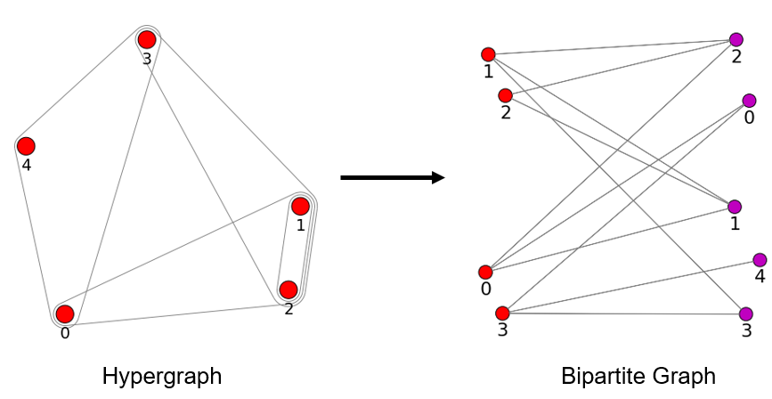

High-Order Structures
-----------------------

Currently, DHG's high-order structures include hypergraph.
In the future, we will add more high-order structures, such as directed hypergraph.

.. _build_hypergraph:

Building Hypergraph
++++++++++++++++++++++++++++
A `hypergraph <https://en.wikipedia.org/wiki/Hypergraph>`_ is a hypergraph with no direction information in each hyperedge.
Each hyperedge in a hypergraph can connect more than two vertices, which can be indicated with a sub-set of total vertices.
A hypergraph can be constructed by the following methods:

- Hyperedge list (**default**) :py:class:`dhg.Hypergraph`
- Features with k-Nearest Neighbors :py:meth:`dhg.Hypergraph.from_feature_kNN`
- Promoted from the low-order structures

  - Graph :py:meth:`dhg.Hypergraph.from_graph`
  - k-Hop Neighbors of vertices in a graph :py:meth:`dhg.Hypergraph.from_graph_kHop`
  - Bipartite Graph :py:meth:`dhg.Hypergraph.from_bigraph`

Common Methods
^^^^^^^^^^^^^^^^^^^

**Construct a hypergraph from edge list with** :py:class:`dhg.Hypergraph`

.. code-block:: python

    >>> hg = dhg.Hypergraph(5, [(0, 1, 2), (2, 3), (0, 4)])
    >>> hg
    Hypergraph(num_v=5, num_e=3)
    >>> hg.e
    ([(0, 1, 2), (2, 3), (0, 4)], [1.0, 1.0, 1.0])
    >>> # print the incidence matrix of the hypergraph
    >>> hg.H.to_dense()
    tensor([[1., 0., 1.],
            [1., 0., 0.],
            [1., 1., 0.],
            [0., 1., 0.],
            [0., 0., 1.]])

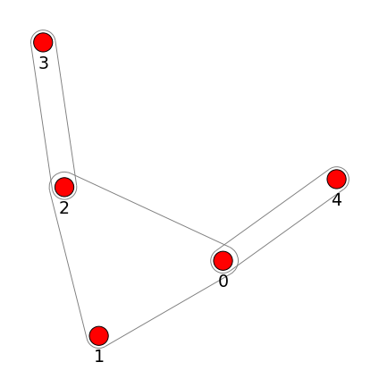

.. important::

    Each hyperedge in the hypergraph is an unordered set of vertices, which means that ``(0, 1, 2)``, ``(0, 2, 1)``, and ``(2, 1, 0)`` are all the same hyperedge.

.. code-block:: python

    >>> hg = dhg.Hypergraph(5, [(0, 2, 1), (2, 3), (0, 4)])
    >>> hg.e
    ([(0, 1, 2), (2, 3), (0, 4)], [1.0, 1.0, 1.0])
    >>> hg.H.to_dense()
    tensor([[1., 0., 1.],
            [1., 0., 0.],
            [1., 1., 0.],
            [0., 1., 0.],
            [0., 0., 1.]])
    >>> hg = dhg.Hypergraph(5, [(1, 0, 2), (2, 3), (0, 4)])
    >>> hg.e
    ([(0, 1, 2), (2, 3), (0, 4)], [1.0, 1.0, 1.0])
    >>> hg.H.to_dense()
    tensor([[1., 0., 1.],
            [1., 0., 0.],
            [1., 1., 0.],
            [0., 1., 0.],
            [0., 0., 1.]])

.. note::

    If the added hyperedges have duplicate hyperedges, those duplicate hyperedges will be automatically merged with specified ``merge_op``.

.. code-block:: python

    >>> hg = dhg.Hypergraph(5, [(0, 1, 2), (2, 3), (2, 3), (0, 4)], merge_op="mean")
    >>> hg.e
    ([(0, 1, 2), (2, 3), (0, 4)], [1.0, 1.0, 1.0])
    >>> hg = dhg.Hypergraph(5, [(0, 1, 2), (2, 3), (2, 3), (0, 4)], merge_op="sum")
    >>> hg.e
    ([(0, 1, 2), (2, 3), (0, 4)], [1.0, 2.0, 1.0])
    >>> hg.add_hyperedges([(0, 2, 1), (0, 4)], merge_op="mean")
    >>> hg.e
    ([(0, 1, 2), (2, 3), (0, 4)], [1.0, 2.0, 1.0])
    >>> hg.add_hyperedges([(0, 2, 1), (0, 4)], merge_op="sum")
    >>> hg.e
    ([(0, 1, 2), (2, 3), (0, 4)], [2.0, 2.0, 2.0])

You can find the weight of the last hyperedge is ``1.0`` and ``2.0``, if you set the ``merge_op`` to ``mean`` and ``sum``, respectively.

**Construct a hypergraph from feature k-Nearest Neighbors with** :py:meth:`dhg.Hypergraph.from_feature_kNN`

.. code-block:: python

    >>> X = torch.tensor([[0.0658, 0.3191, 0.0204, 0.6955],
                          [0.1144, 0.7131, 0.3643, 0.4707],
                          [0.2250, 0.0620, 0.0379, 0.2848],
                          [0.0619, 0.4898, 0.9368, 0.7433],
                          [0.5380, 0.3119, 0.6462, 0.4311],
                          [0.2514, 0.9237, 0.8502, 0.7592],
                          [0.9482, 0.6812, 0.0503, 0.4596],
                          [0.2652, 0.3859, 0.8645, 0.7619],
                          [0.4683, 0.8260, 0.9798, 0.2933],
                          [0.6308, 0.1469, 0.0304, 0.2073]])
    >>> hg = dhg.Hypergraph.from_feature_kNN(X, k=3)
    >>> hg
    Hypergraph(num_v=10, num_e=9)
    >>> hg.e
    ([(0, 1, 2), (0, 1, 5), (0, 2, 9), (3, 5, 7), (4, 7, 8), (4, 6, 9), (3, 4, 7), (4, 5, 8), (2, 6, 9)], [1.0, 1.0, 1.0, 1.0, 1.0, 1.0, 1.0, 1.0, 1.0])
    >>> hg.H.to_dense()
    tensor([[1., 1., 1., 0., 0., 0., 0., 0., 0.],
            [1., 1., 0., 0., 0., 0., 0., 0., 0.],
            [1., 0., 1., 0., 0., 0., 0., 0., 1.],
            [0., 0., 0., 1., 0., 0., 1., 0., 0.],
            [0., 0., 0., 0., 1., 1., 1., 1., 0.],
            [0., 1., 0., 1., 0., 0., 0., 1., 0.],
            [0., 0., 0., 0., 0., 1., 0., 0., 1.],
            [0., 0., 0., 1., 1., 0., 1., 0., 0.],
            [0., 0., 0., 0., 1., 0., 0., 1., 0.],
            [0., 0., 1., 0., 0., 1., 0., 0., 1.]])

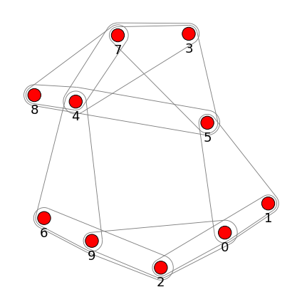

.. note::

    Those duplicated hyperedges are merged with ``mean`` operation.

Prometed from Low-Order Structures
^^^^^^^^^^^^^^^^^^^^^^^^^^^^^^^^^^^^

**Construct a hypergraph from a graph with** :py:meth:`dhg.Hypergraph.from_graph`

.. code-block:: python

    >>> g = dhg.Graph(5, [(0, 1), (1, 2), (2, 3), (1, 4)])
    >>> g.e
    ([(0, 1), (1, 2), (2, 3), (1, 4)], [1.0, 1.0, 1.0, 1.0])
    >>> g.A.to_dense()
    tensor([[0., 1., 0., 0., 0.],
            [1., 0., 1., 0., 1.],
            [0., 1., 0., 1., 0.],
            [0., 0., 1., 0., 0.],
            [0., 1., 0., 0., 0.]])
    >>> hg = dhg.Hypergraph.from_graph(g)
    >>> hg.e
    ([(0, 1), (1, 2), (2, 3), (1, 4)], [1.0, 1.0, 1.0, 1.0])
    >>> hg.H.to_dense()
    tensor([[1., 0., 0., 0.],
            [1., 1., 0., 1.],
            [0., 1., 1., 0.],
            [0., 0., 1., 0.],
            [0., 0., 0., 1.]])

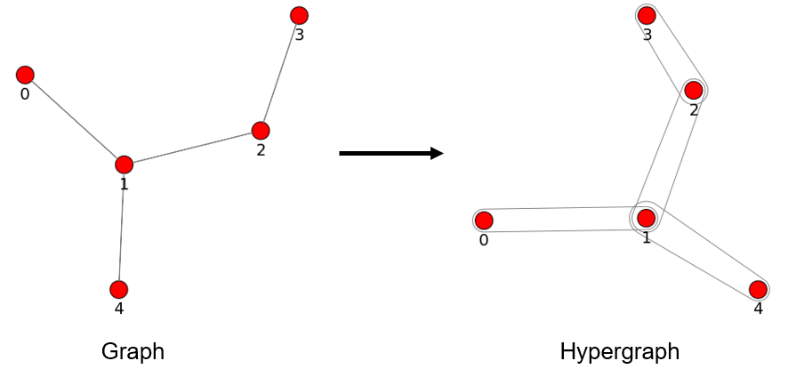

**Construct a hypergraph from vertex's k-Hop neighbors of a graph with** :py:meth:`dhg.Hypergraph.from_graph_kHop`

.. code-block:: python

    >>> g = dhg.Graph(5, [(0, 1), (1, 2), (2, 3), (1, 4)])
    >>> g.e
    ([(0, 1), (1, 2), (2, 3), (1, 4)], [1.0, 1.0, 1.0, 1.0])
    >>> g.A.to_dense()
    tensor([[0., 1., 0., 0., 0.],
            [1., 0., 1., 0., 1.],
            [0., 1., 0., 1., 0.],
            [0., 0., 1., 0., 0.],
            [0., 1., 0., 0., 0.]])
    >>> hg = dhg.Hypergraph.from_graph_kHop(g, k=1)
    >>> hg.e
    ([(0, 1), (0, 1, 2, 4), (1, 2, 3), (2, 3), (1, 4)], [1.0, 1.0, 1.0, 1.0, 1.0])
    >>> hg.H.to_dense()
    tensor([[1., 1., 0., 0., 0.],
            [1., 1., 1., 0., 1.],
            [0., 1., 1., 1., 0.],
            [0., 0., 1., 1., 0.],
            [0., 1., 0., 0., 1.]])
    >>> hg = dhg.Hypergraph.from_graph_kHop(g, k=2)
    >>> hg.e
    ([(0, 1, 2, 4), (0, 1, 2, 3, 4), (1, 2, 3)], [1.0, 1.0, 1.0])
    >>> hg.H.to_dense()
    tensor([[1., 1., 0.],
            [1., 1., 1.],
            [1., 1., 1.],
            [0., 1., 1.],
            [1., 1., 0.]])

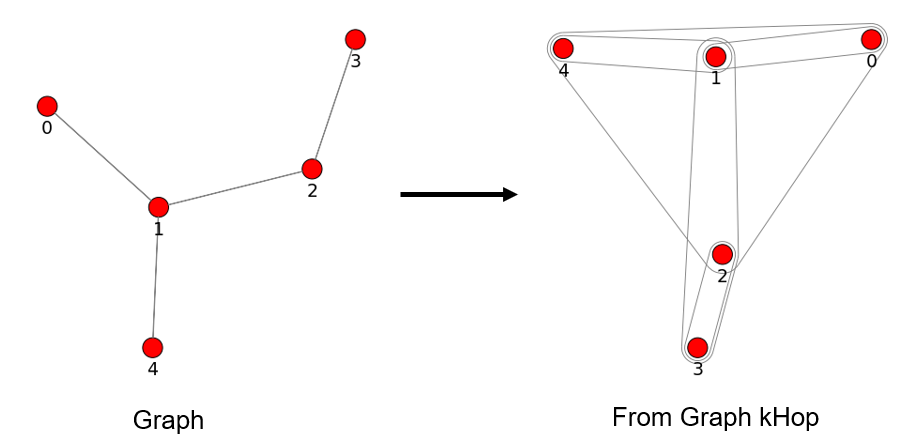

**Construct a hypergraph from a bipartite graph with** :py:meth:`dhg.Hypergraph.from_bigraph`

    .. code-block:: python

        >>> g = dhg.BiGraph(4, 3, [(0, 1), (1, 1), (2, 1), (3, 0), (1, 2)])
        >>> g
        Bipartite Graph(num_u=4, num_v=3, num_e=5)
        >>> g.e
        ([(0, 1), (1, 1), (2, 1), (3, 0), (3, 2)], [1.0, 1.0, 1.0, 1.0, 1.0])
        >>> g.B.to_dense()
        tensor([[0., 1., 0.],
                [0., 1., 0.],
                [0., 1., 0.],
                [1., 0., 1.]])
        >>> hg = dhg.Hypergraph.from_bigraph(g, U_as_vertex=True)
        >>> hg
        Hypergraph(num_v=4, num_e=3)
        >>> hg.e
        ([(3,), (0, 1, 2), (1,)], [1.0, 1.0, 1.0])
        >>> hg.H.to_dense()
        tensor([[0., 1., 0.],
                [0., 1., 1.],
                [0., 1., 0.],
                [1., 0., 0.]])
        >>> hg = dhg.Hypergraph.from_bigraph(g, U_as_vertex=False)
        >>> hg
        Hypergraph(num_v=3, num_e=3)
        >>> hg.e
        ([(1,), (1, 2), (0,)], [1.0, 1.0, 1.0])
        >>> hg.H.to_dense()
        tensor([[0., 0., 1.],
                [1., 1., 0.],
                [0., 1., 0.]])

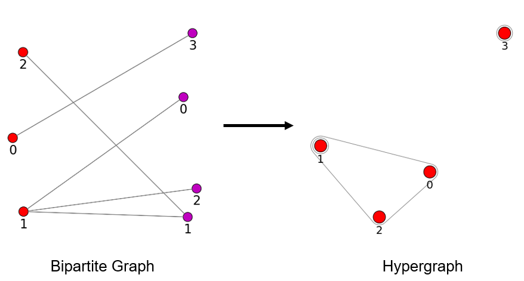
