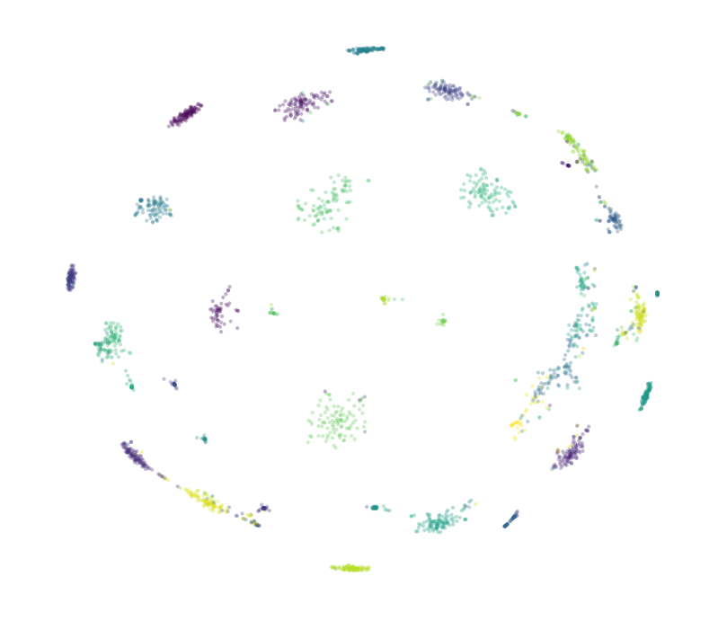
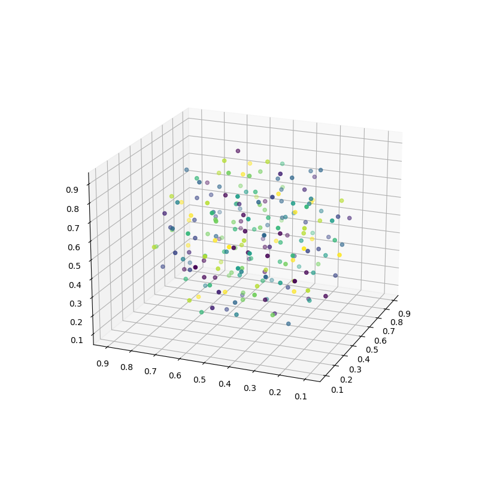
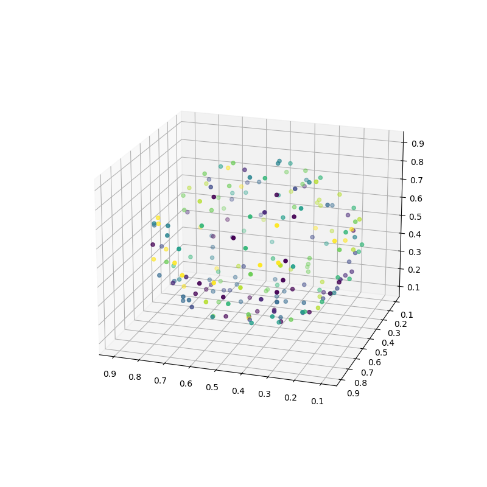

Feature Visualization
=========================

.. hint:: 

    - Author: Qingmei Tang
    - Proof: `Yifan Feng (丰一帆) <https://fengyifan.site/>`_

Basic Usages
---------------
DHG provides an interface to visualize the distribution of features:

1. Input the features and label (optional);
2. Specify parameters (*i.e.*, `the dimensionality of the visualisation`, `point size`, `color` and `the method of dimensionality reduction`);
3. Call ``plt.show()`` function to show the figure/animation.

   
.. note:: The ``plt`` is short for ``matplotlib.pyplot`` module.

Visualization of Features in Euclidean Space
^^^^^^^^^^^^^^^^^^^^^^^^^^^^^^^^^^^^^^^^^^^^^^^^^^^^

.. image:: ../_static/img/vis_ft_euclidean.png
    :align: center
    :alt: Visualization of Features in Euclidean Space
    :height: 400px

.. code-block:: python

    >>> import dhg
    >>> import numpy as np
    >>> import matplotlib.pyplot as plt
    >>> import dhg.visualization as vis
    >>> lbl = (np.random.rand(200)*10).astype(int)
    >>> ft = dhg.random.normal_features(lbl)
    >>> vis.draw_in_euclidean_space(ft, lbl)
    >>> plt.show()

..
    >>> import numpy as np
    >>> from dhg.visualization.feature import draw_in_euclidean_space
    >>> ile_dir = "data/modelnet40/test_img_feat_4.npy"
    >>> save_dir = None  # None for show now or file name to save
    >>> label = np.load("data/modelnet40/test_label.npy")
    >>> ft = np.load(file_dir)
    >>> d = 2
    >>> low_demen_method = "tsne"  # vis for poincare_ball: pca or tsne
    >>> show_method = None # None for 2d or Rotation and Drag for 3d
    >>> draw_in_euclidean_ball(
            ft, save_dir, d, label, reduce_method=low_demen_method, auto_play=show_method
        )

Visualization of Features in Poincare Space
^^^^^^^^^^^^^^^^^^^^^^^^^^^^^^^^^^^^^^^^^^^^^^^^^^^^

.. code-block:: python

    >>> import dhg
    >>> import numpy as np
    >>> import matplotlib.pyplot as plt
    >>> import dhg.visualization as vis
    >>> lbl = (np.random.rand(200)*10).astype(int)
    >>> ft = dhg.random.normal_features(lbl)
    >>> vis.draw_in_poincare_space(ft, lbl)
    >>> plt.show()

..
    >>> import numpy as np
    >>> from dhg.visualization.feature import draw_in_poincare_space
    >>> file_dir = "data/modelnet40/test_img_feat_4.npy" #This varies depending on the situation
    >>> save_dir = None  # None for show now or file name to save
    >>> label = np.load("data/modelnet40/test_label.npy")
    >>> ft = np.load(file_dir)
    >>> d = 2
    >>> low_demen_method = "tsne"  # vis for poincare_ball, pca or tsne
    >>> show_method = None  # None for 2d or Rotation and Drag for 3d
    >>> draw_in_poincare_ball(
            ft, save_dir, d, label, reduce_method=low_demen_method, auto_play=show_method
        )

Make Animation
-------------------------

We provide functions to make 3D rotation animation for feature visualization.

Rotating Visualization of Features in Euclidean Space
^^^^^^^^^^^^^^^^^^^^^^^^^^^^^^^^^^^^^^^^^^^^^^^^^^^^^^^^

.. code-block:: python

    >>> import dhg
    >>> import numpy as np
    >>> import matplotlib.pyplot as plt
    >>> import dhg.visualization as vis
    >>> lbl = (np.random.rand(200)*10).astype(int)
    >>> ft = dhg.random.normal_features(lbl)
    >>> vis.animation_of_3d_euclidean_space(ft, lbl)
    >>> plt.show()

.. 
    >>> import numpy as np
    >>> from dhg.visualization.feature import animation_of_3d_euclidean_ball
    >>> ile_dir = "data/modelnet40/test_img_feat_4.npy"
    >>> save_dir = None  # None for show now or file name to save
    >>> label = np.load("data/modelnet40/test_label.npy")
    >>> ft = np.load(file_dir)
    >>> d = 3
    >>> low_demen_method = "tsne"  # vis for poincare_ball: pca or tsne
    >>> show_method = "Rotation"  # None for 2d or Rotation and Drag for 3d
    >>> animation_of_3d_euclidean_ball(
            ft, save_dir, d, label, reduce_method=low_demen_method, auto_play=show_method
        )

Rotating Visualization of Features in Poincare Space
^^^^^^^^^^^^^^^^^^^^^^^^^^^^^^^^^^^^^^^^^^^^^^^^^^^^^^^

.. code-block:: python

    >>> import dhg
    >>> import numpy as np
    >>> import matplotlib.pyplot as plt
    >>> import dhg.visualization as vis
    >>> lbl = (np.random.rand(200)*10).astype(int)
    >>> ft = dhg.random.normal_features(lbl)
    >>> vis.animation_of_3d_poincare_ball(ft, lbl)
    >>> plt.show()

..
    >>> import numpy as np
    >>> from dhg.visualization.feature import animation_of_3d_poincare_ball
    >>> file_dir = "data/modelnet40/test_img_feat_4.npy" #This varies depending on the situation
    >>> save_dir = None  # None for show now or file name to save
    >>> label = np.load("data/modelnet40/test_label.npy")
    >>> ft = np.load(file_dir)
    >>> d = 3
    >>> low_demen_method = "tsne"  # vis for poincare_ball, pca or tsne
    >>> show_method = "Rotation"  # None for 2d or Rotation and Drag for 3d
    >>> animation_of_3d_poincare_ball(
            ft, save_dir, d, label, reduce_method=low_demen_method, auto_play=show_method
        )

Mathematical Principles of Hyperbolic Space
--------------------------------------------------

The hyperbolic space is a manifold with constant Gaussian constant negative curvature everywhere, 
which has several models. We base our work on the Poincaré ball model for its well-suited for gradient-based optimization. 

The Poincaré ball model with constant negative curvature :math:`-1 / k(k>0)` corresponds to the 
Riemannian manifold 
:math:`\left(\mathbb{P}^{n,k},  g_{\mathbf{x}}^{\mathbb{P}}\right)`. 
:math:`\mathbb{P}^{n,k} = \left\{\mathbf{x} \in \mathbb{R}^{n}: \| \mathbf{x}\|<1 \right\}` is an open :math:`n`-demensionsional unit ball, 
where :math:`\|. \|` denotes the Euclidean norm. Its metric tensor is :math:`g_{\mathbf{x}}^{\mathbb{P}} = \lambda_{\mathbf{x}}^{2} g^{E}`, 
where :math:`\lambda_{\mathbf{x}} = \frac{2} {1- k\|\mathbf{x}\|^{2} }` is the conformal factor and :math:`g^{E}=\mathbf{I}_{n}` is the Euclidean metric tensor. 
For two points :math:`\mathbf{x}, \mathbf{y} \in \mathbb{P}^{n,k}`, we ues the Möbius addition :math:`\oplus` operate adding 
by connecting the gyrospace framework with Riemannian geometry:

.. math::

    \mathbf{x} \oplus_{k} \mathbf{y} =\frac{\left(1+2k\langle\mathbf{x}, \mathbf{y}\rangle+k\|\mathbf{y}\|^{2}\right) \mathbf{x}+\left(1-k\|\mathbf{x}\|^{2}\right) \mathbf{y}}{1+2k\langle\mathbf{x}, \mathbf{y}\rangle+k^{2}\|\mathbf{x}\|^{2}\|\mathbf{y}\|^{2}} .

The distance between two points :math:`\mathbf{x}, \mathbf{y} \in \mathbb{P}^{n,k}` is calculated by integration of the metric tensor, which is given as:

.. math::

    d_{\mathbb{P}}^{k} (\mathbf{x}, \mathbf{y}) = (2 / \sqrt{K}) \tanh ^{-1}\left(\sqrt{k}\left\|-x \oplus_{k} y\right\|\right) .

Denote point :math:`\mathbf{z} \in \mathcal{T}_{\mathrm{x}} \mathbb{P}^{n,k}` the tangent (Euclidean) space centered at any point :math:`\mathbf{x}` in the hyperbolic space. 
For the tangent vector :math:`\mathbf{z} \neq \mathbf{0}` and the point :math:`\mathbf{y} \neq \mathbf{0}`, 
the exponential map :math:`\exp _{\mathbf{x}}: \mathcal{T}_{\mathbf{x}} \mathbb{P}^{n,k} \rightarrow \mathbb{P}^{n,k}` and 
the logarithmic map :math:`\log_{\mathbf{x}}: \mathbb{P}^{n,k} \rightarrow \mathcal{T}_{\mathbf{x}} \mathbb{P}^{n,k}` are given for 
:math:`\mathbf{y} \neq \mathbf{x}` by:

.. math::

    \exp _{\mathbf{x}}^{k}(\mathbf{z})=\mathbf{x} \oplus_{k}\left(\tanh \left(\sqrt{k} \frac{\lambda_{\mathbf{x}}^{k}\|\mathbf{z}\|}{2}\right) \frac{\mathbf{z}}{\sqrt{k}\|\mathbf{z}\|}\right), 

and

.. math::

    \log _{\mathbf{x}}^{k}(\mathbf{y})=\frac{2}{\sqrt{k} \lambda_{\mathbf{x}}^{k}} \tanh ^{-1}\left(\sqrt{k}\left\|-\mathbf{x} \oplus_{k} \mathbf{y}\right\|\right) \frac{-\mathbf{x} \oplus_{k} \mathbf{y}}{\left\|-\mathbf{x} \oplus_{k} \mathbf{y}\right\|} .

It is noted that our initial data are on Euclidean space and need to be converted to embeddings on hyperbolic space, so first project the data on the previously obtained Euclidean space onto the hyperbolic manifold space 
in order to use the Spectral-based hypergraph hyperbolic convolutional network to learn the information to update the node embeddings. 
Set :math:`t:=\{\sqrt{K}, 0, 0, \dots, 0\}\in\mathbb{P}^{d, K}` as a reference point to perform tangent space operations, 
where :math:`-1/K` is the negative curvature of hyperbolic model. 
The above premise makes :math:`\langle(0, \mathbf{x}^{0, E}), t\rangle=0` hold, 
so :math:`(0, \mathbf{x}^{0, E})` can be regarded as the initial embedding representation of the hypergraph structure on the tangent plane 
of the hyperbolic manifold space :math:`\mathcal{T}_t\mathbb{P}^{d, K}`. The initial hypergraph structure embedding is 
then mapped onto the hyperbolic manifold space :math:`\mathbb{P}` using the following equation:

.. math::

    \mathbf{x}^{0, \mathbb{P}} &=\exp _{t}^{K}\left(\left(0, \mathbf{x}^{0, \mathrm{E}}\right)\right) \\
    &=\left(\sqrt{K} \cosh \left(\frac{\left\|\mathbf{x}^{0, \mathbb{E}}\right\|_{2}}{\sqrt{K}}\right), 
    \sqrt{K} \sinh \left(\frac{\left\|\mathbf{x}^{0, \mathbb{E}}\right\|_{2}}{\sqrt{K}}\right) \frac{\mathbf{x}^{0, \mathbb{E}}}{\left\|\mathbf{x}^{0, \mathbb{E}}\right\|_{2}}\right).

The hyperbolic operation is accomplished by means of a feature mapping between Euclidean space and Hyperbolic space.

