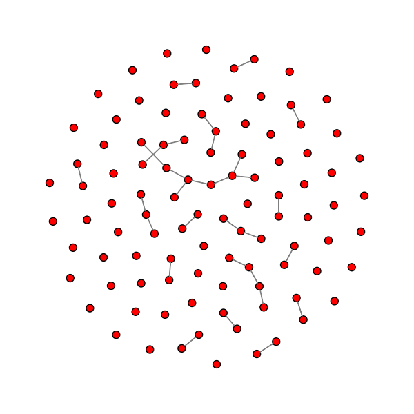
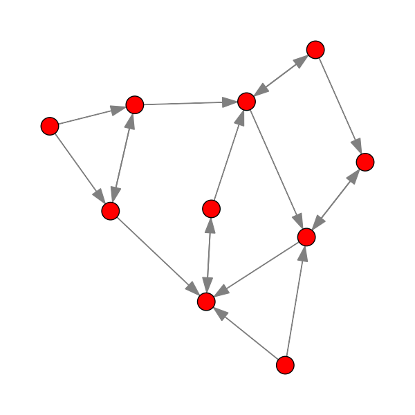
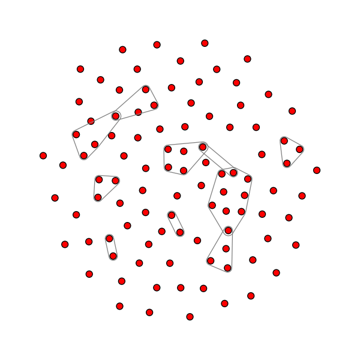
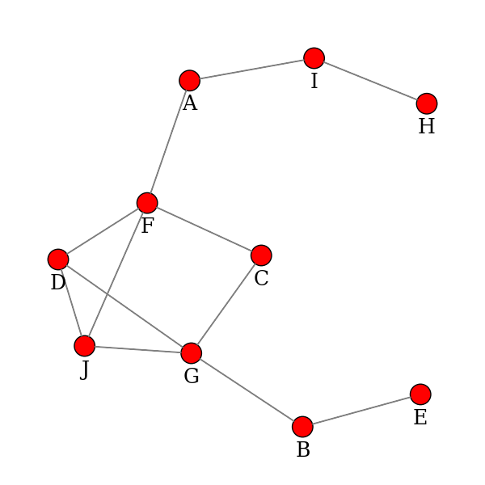
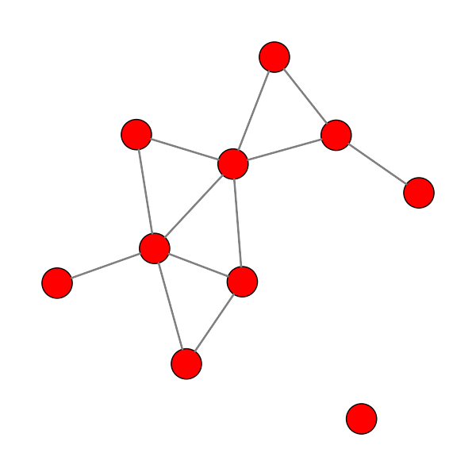

Structure Visualization
=============================

.. hint::

    - Author: Xinwei Zhang
    - Proof: `Yifan Feng (丰一帆) <https://fengyifan.site/>`_

Basic Usages
--------------
DHG provides a simple interface to visualize the correlation structures:

1. Create a structure object (*i.e.*, :py:class:`dhg.Graph`, :py:class:`dhg.BiGraph`, :py:class:`dhg.DiGraph`, and :py:class:`dhg.Hypergraph`);
2. Call the ``draw()`` method of the object;
3. Call ``plt.show()`` to show the figure or ``plt.savefig()`` to save the figure.

.. note:: The ``plt`` is short for ``matplotlib.pyplot`` module.

Visualization of Graph
^^^^^^^^^^^^^^^^^^^^^^^^^^^^^^^^^^^^^^^^^^^^^^^^^^^^

.. code-block:: python

    >>> import matplotlib.pyplot as plt
    >>> from dhg.random import graph_Gnm
    >>> g = graph_Gnm(10, 12)
    >>> g.draw()
    >>> plt.show()

Visualization of Directed Graph
^^^^^^^^^^^^^^^^^^^^^^^^^^^^^^^^^

.. code-block:: python

    >>> import matplotlib.pyplot as plt
    >>> from dhg.random import digraph_Gnm
    >>> g = digraph_Gnm(12, 18)
    >>> g.draw()
    >>> plt.show()

Visualization of Bipartite Graph
^^^^^^^^^^^^^^^^^^^^^^^^^^^^^^^^^^

.. image:: ../_static/img/vis_bigraph.png
    :align: center
    :alt: Visualization of Bipartite Graph
    :height: 400px

.. code-block:: python

    >>> import matplotlib.pyplot as plt
    >>> from dhg.random import bigraph_Gnm
    >>> g = bigraph_Gnm(30, 40, 20)
    >>> g.draw()
    >>> plt.show()

Visualization of Hypergraph
^^^^^^^^^^^^^^^^^^^^^^^^^^^^^^^^^^^^^^^^

.. code-block:: python

    >>> import matplotlib.pyplot as plt
    >>> from dhg.random import hypergraph_Gnm
    >>> hg = hypergraph_Gnm(10, 8, method='low_order_first')
    >>> hg.draw()
    >>> plt.show()

Advanced Usages
---------------------

Customize Labels
^^^^^^^^^^^^^^^^^^^^^^^^^
The labels of the vertices could be customized by the ``v_label`` argument. The ``v_label`` could be a list of strings. The labels of the vertices are the strings in the list.
For example, the following code shows how to customize the labels of the vertices of a graph.
If the ``v_label`` is not specified, no labels will be shown in the figure.
The ``font_size`` argument for ``dhg.Graph``, ``dhg.DiGraph``, and ``dhg.Hypergraph``, as well as ``u_font_size`` and ``v_font_size`` for ``dhg.BiGraph`` is used to specify the relative size of the font of the labels, and the default value is ``1.0``.
The ``font_family`` argument is used to specify the font family of the labels, and the default value is ``'sans-serif'``.

.. code-block:: python

    >>> import matplotlib.pyplot as plt
    >>> from dhg.random import graph_Gnm
    >>> g = graph_Gnm(10, 12)
    >>> labels = ['A', 'B', 'C', 'D', 'E', 'F', 'G', 'H', 'I', 'J']
    >>> g.draw(v_label=labels, font_size=1.5, font_family='serif')
    >>> plt.show()

Customize Colors
^^^^^^^^^^^^^^^^^^^^^^^^^
For ``dhg.Graph``, ``dhg.DiGraph``, and ``dhg.Hypergraph``, the colors of the vertices could be customized by the ``v_color`` argument and the colors of the edges could be customized by the ``e_color`` argument. While for ``dhg.BiGraph``, the colors of the vertices in :math:`\mathcal{U}` could be customized by the ``u_color`` argument and the colors of the vertices in  :math:`\mathcal{V}` could be customized by the ``v_color`` argument.  Both the ``v_color``, ``u_color``, and ``e_color`` could be a string or list of strings. If a string is provided, all the vertices or edges will be colored by the string. If a list of strings is provided, the colors of the vertices or edges are the strings in the list. For example, the following code shows how to customize the colors of the vertices and edges of a hypergraph.

.. code-block:: python

    >>> import matplotlib.pyplot as plt
    >>> from dhg.random import hypergraph_Gnm
    >>> hg = hypergraph_Gnm(10, 8, method='low_order_first')
    >>> hg.draw(v_color='cyan', e_color='grey')
    >>> plt.show()

.. image:: ../_static/img/custom_color.png
    :align: center
    :alt: Customize color
    :height: 400px

Customize Sizes
^^^^^^^^^^^^^^^^^^^^^^^^^
For ``dhg.Graph``, ``dhg.DiGraph``, and ``dhg.Hypergraph``, the sizes of the vertices could be customized by the ``v_size`` argument and the sizes of the edges could be customized by the ``e_size`` argument. While for ``dhg.BiGraph``, the sizes of the vertices in :math:`\mathcal{U}` could be customized by the ``u_size`` argument and the sizes of the vertices in  :math:`\mathcal{V}` could be customized by the ``v_size`` argument.  Both the ``v_size``, ``u_size``, and ``e_size`` could be a float or list of float. If a float is provided, all the vertices or edges will be sized by the float. If a list of floats is provided, the sizes of the vertices or edges are the floats in the list. ``v_line_width`` represents the width of the surrounding line of the vertices. ``e_line_width`` represents the width of the line of the edges.
All of the sizes above represent the relative size, and the default values are ``1.0``. For example, the following code shows how to customize the sizes of the vertices and edges of a hypergraph.

.. code-block:: python

    >>> import matplotlib.pyplot as plt
    >>> from dhg.random import graph_Gnm
    >>> g = graph_Gnm(10, 12)
    >>> g.draw(v_size=1.5, v_line_width=1.5, e_line_width=1.5)
    >>> plt.show()

Customize Layout
^^^^^^^^^^^^^^^^^^^^^^^^^
The layout of the structures is based on the modified directed-force layout algorithm. There are four forces to determine the position of the nodes, *i.e.*, node attraction force :math:`f_{na}`, node repulsion force :math:`f_{nr}`, edge repulsion force :math:`f_{er}`, and the center force :math:`f_c`. :math:`f_{na}` is the spring force which attracts the adjacent nodes. :math:`f_{nr}` is used to repel the nodes from each other. :math:`f_{er}` is used to repel the hyperedges from each other, which only make sense for hypergraph visualization. :math:`f_c` is used to attract the nodes to the center (two centers for the bipartite graphs).
The strength of the forces could be customized by ``forces`` argument, which is a dictionary with the keys ``Simulator.NODE_ATTRACTION``, ``Simulator.NODE_REPULSION``, ``Simulator.EDGE_REPULSION``, and ``Simulator.CENTER_GRAVITY``. The default values of the forces are ``1.0``.

.. different style, change size, change color, change opacity

.. Mathamatical Principles
.. -----------------------

.. Graph
.. ~~~~~~~~~~~~~~

.. Directed Graph
.. ~~~~~~~~~~~~~~~

.. Bipartite Graph
.. ~~~~~~~~~~~~~~~~

.. Hypergraph
.. ~~~~~~~~~~~~~~~~~~
